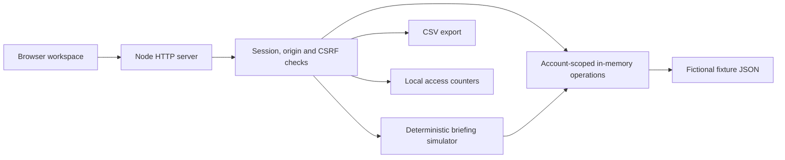

# AI Operations Cockpit

A compact operations workspace demonstrating how a service workflow can become a controlled, reviewable software product: plan work, follow checklists, identify exceptions, and request a briefing grounded in explicit records.

> Portfolio demonstration based on a real-world use case; client identity and operational data removed/replaced.

This is an **offline portfolio edition**. The assistant is a deterministic simulator, clearly labeled in the interface and API. No language model, voice service, database, business connector, webhook or external CDN is connected. It makes no claims about AI accuracy, customer revenue or production impact.

## Run locally

Requires Node.js 22 or later. There are no package dependencies to install.

```sh
npm run setup
npm start
```

Open `http://127.0.0.1:4318`. Setup generates fresh random credentials for `admin`, `operator` and `reviewer` in ignored `demo-access.txt`, and password hashes plus a session signing secret in ignored `.env`. It refuses to overwrite existing configuration. Never add these files to Git. Keep generated credentials in a password manager if you retain the demo. Do not put real operational data into it.

```sh
npm test
npm run check
```

The release check requires a Git checkout with tracked files. It is a heuristic, not a certification that no secret can exist.

## Features

- Twelve entirely new fictional operations in a fixed June 2030 scenario.
- Search, status filters, account-isolated checklist updates and scenario reset.
- Revenue and direct-cost contribution indicators with explicit financial limits.
- CSV export with spreadsheet-formula neutralization.
- Simulated summaries and priorities with record references.
- Scrypt password hashing, signed HttpOnly sessions, CSRF and origin checks.
- Administrator access suspension, per-account request quotas and duplicate-request rejection.
- Strict browser content policy; all assets served locally.

## Architecture



**Stack:** Node.js standard library, CommonJS, native browser JavaScript, HTML and CSS, JSON fixtures, Node test runner. No hosted infrastructure is required.

`access.cjs` retains the reviewed access-control core from the source use case. The portfolio edition rebuilds the interface, fixture dataset, server routing and briefing boundary to remove client-specific material and live integrations. Model execution, document-generation dependencies, deployment manifests, operational reference material and original Git history were excluded deliberately.

## Security and data boundaries

The local server binds to loopback by default. Operations exist only in server memory, separately for each demo account, and reset on restart. Access counters persist in ignored `.private/state`; they do not contain prompts, passwords or raw session tokens. Authentication sessions expire and disappear on restart. Exports contain the fictional records in the current demo account.

No environment variable can enable an external AI provider in this edition. Adding one would be a separate implementation requiring server-side credentials, authorization, bounded input/output, timeouts, evaluations and cost controls.

## Limits

- This is a demonstration, not a production SaaS or a real AI evaluation.
- Roles distinguish administration from normal demo access; operator and reviewer share the same normal capabilities.
- Single server process; no distributed session storage or durable operational database.
- Request counters use synchronous local-file writes and are not designed for high throughput.
- A public hosted demo would require separate deployment review, HTTPS, proxy configuration and access credentials. Publishing source code does not deploy the application.
- No live voice, LLM, email, invoicing, web search or document-generation connection.
- Contribution is revenue minus direct cost; overhead, taxes and net profit are not modeled.

## Portfolio narrative

The engineering evidence is the boundary between a useful operational workflow and controlled software behavior: explicit data scope, human review, access control, request budgets and reproducible tests. The simulator makes that boundary inspectable without exposing a customer system or incurring API costs.

See [SECURITY.md](SECURITY.md) for the release boundary. No open-source license is asserted for retained application code; publishing or licensing rights must be confirmed by the owner before public release.
